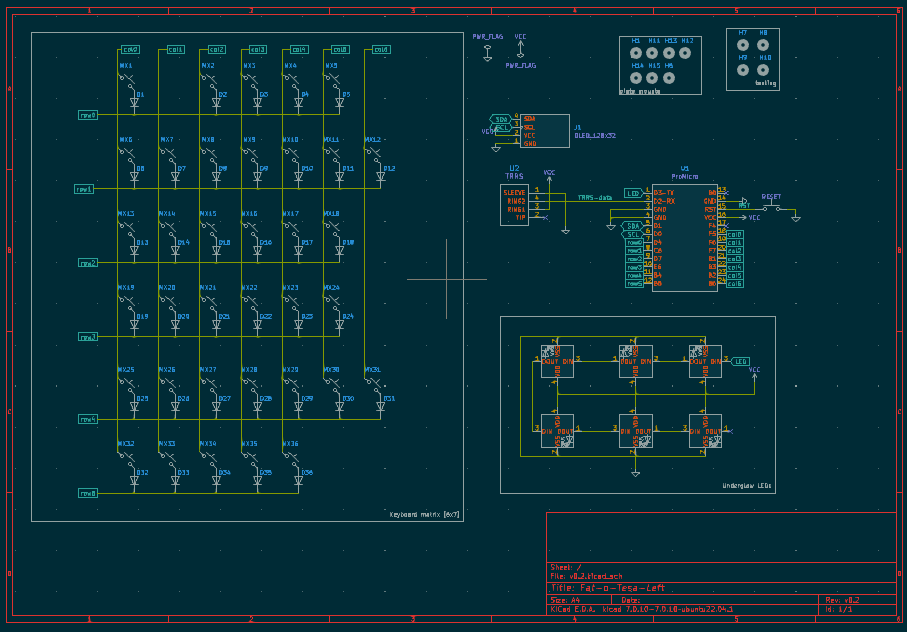
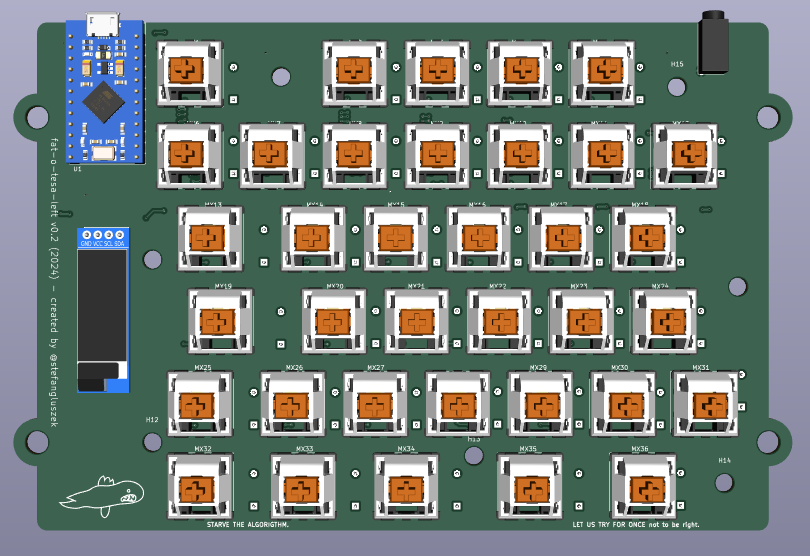
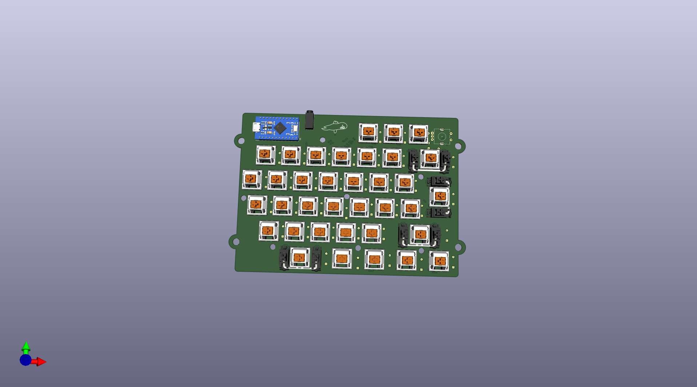
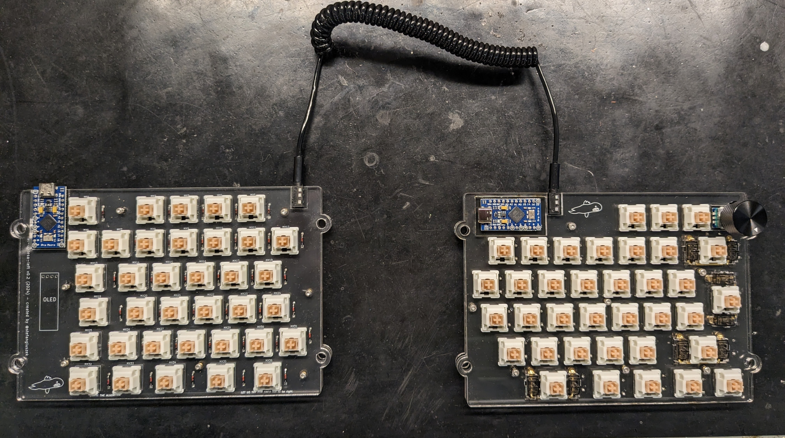

# Fat-o-tesa - v0.2

## Introduction
This repository documents my attempt at building a custom mechanical keyboard. I have been considering switching to a split ergonomic keyboard such as the [Ergodox](https://ergodox-ez.com/) for a while now.
I hesitated, mostly because I love my current Varmillo Mechanical keyboard and I was not sure if switching back and forth between the two would be a good idea. At the end I decided it was more about learning the process of building a custom keyboard than actually using it. So I decided to design and build my own custom mechanical keyboard.

The requirements I had were simple, a split mechanical keyboard with the base layout as close to the ISO layout as possible to make switching back and forth as painless as possible. Why ISO? Because I use a Swedish/Norwegian keyboard which uses the ISO layout.

## The layout
I used the [Keyboard Layout Editor](http://www.keyboard-layout-editor.com/) to create the layout. It's based on the ISO 60% preset, but includes the top row with a couple of functional keys. I will explain why I needed the top row later on when we get to the PCB design.

The raw layout can be found [here](layouts/layout.kle).

## version v0.2
This is my second attempt at designing the PCBs. The [first version](README.v0.1.md) was a good learning experience but it had some major flaws that are addressed in this version.

## PCB design
The PCB is designed in KiCAD 7. The schematics are improved compared to v0.1. I grouped things together by function and made sure all symbols are consistent and match the PCB. I have also made sure to have all the footprint libraries available.

The PCB routing and component placement is also improved. All signal traces are routed on the bottom layer and the top layer is used as a ground layer. Since this is a keyboard matrix, I had to use some vias to jump over the vertical traces when routing the horizontal ones. An alternative, which most other keyboards seem to go for, is to route columns on the top and rows on the bottom layer. The wiring would be cleaner but you end up cutting the ground plane with long traces across the entire PCB, which according to [Rick Hartley](https://www.youtube.com/watch?v=ySuUZEjARPY) is not good. It probably doesn't matter for simple passive switches but I have the IC2 for the RGB LEDs so I thought, what the heck, let's try that. Another alternative was a 4 layer board, with signals on top and bottom with ground on the middle layers. 4 layer PCBs are more expensive, and since I don't believe this to be the final prototype, I decided to stick with 2 layers. Also, I've decided to order left and right PCBs separately. This way I can learn for half the cost. I made sure to have all 3D models available to make sure I didn't end up with any overlapping components like I did in v0.1.

